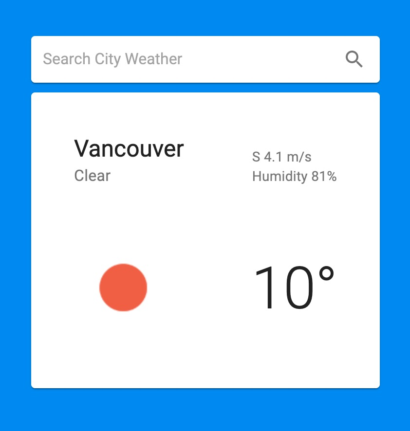

# weather-service

## Notes

A simple application that will get the weather for a specific city:



### Date

March 22, 2020

### Location of deployed application

The client side project is built using React with Material-UI and deployed on Netlify: https://weather-service.netlify.com/
The server side project is built using Node.js with Express and deployed on Heroku.

### Time spent

About 6 hours.

### Shortcuts/Compromises made

If I got more time, I will add authentication to the service to improve security. I will add more front-end testing using Jest and Cypress to do automatic testing. I will also improve the error handling UI with some edge cases to improve the user experience.

### Stretch goals attempted

I build a simple UI for the service using React and Material-UI and I deployed the backend service to Heroku and frontend to Netlify. I proxy a real weather API to fetch the actual weather using [openweathermap](https://openweathermap.org/current) as my data source. I wish I can add another security layer to my backend service since it's now public. It was quite fast to set up the React project with create-react-app and the Material-UI helps a lot with the UI development. It allows me to focus more on the component logic rather than spending too much time on design.

### Instructions to run assignment locally

Backend:

```
> cd server/
> npm install
> npm start
```

The backend service will run on [http://localhost:8001](http://localhost:8001)

Deploy to Heroku:

```
> git subtree push --prefix server heroku master
```

Frontend:

```
> cd client/
> npm install
> npm start
```

You can view the client on [http://localhost:3000](http://localhost:3000)

### What did you not include in your solution that you want us to know about?

I chose node.js with express for my backend service because it was really easy and fast to set up the environment and the application. Express got a myriad of HTTP utility methods and middleware that allows me to create robust APIs quickly. It was also well supported in the community and updated regularly. It was also convenient to write Javascript in both the backend and frontend. However, node.js is single-threaded which makes it harder to take advantage of multiple processors. It will hit bottlenecks with heavy computation tasks.

I chose React.js with Material-UI for my frontend to quickly build a SPA with material design. Reuseable React components significantly save development time. However, it might influence SEO since search engines poorly index dynamic web pages with client-side rendering.

### Other information about your submission that you feel it's important that we know if applicable.

I used ESLint and Prettier for lint errors and format code.
I used Jest and Supertest in the backend to test code.

### Your feedback on this technical challenge

It was a good technical challenge with detailed instruction and real-world tasks to solve. I really enjoy doing this challenge.
